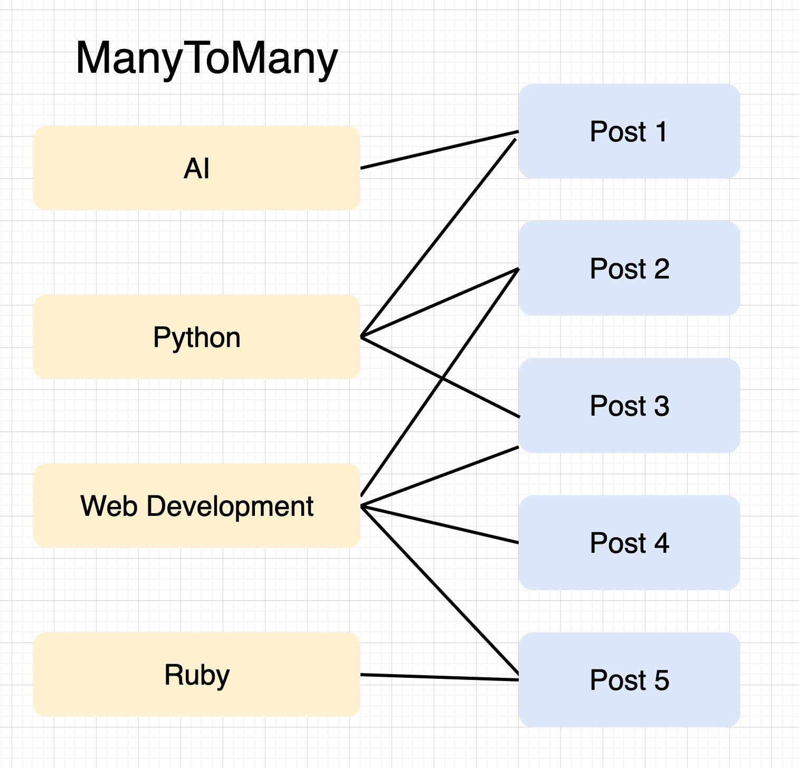

# djangoチュートリアル #6 データの取得・作成・編集・削除

## 完成版プロジェクトURL

https://github.com/shun-rec/django-website-06

## ブログのモデルを作成しよう！




### モデルの作成ひな形

```py
from django.db import models

class Post(models.Model):
    title = models.CharField(max_length=255, null=False, blank=False)
    body = models.TextField(null=False, blank=False)
    created = models.DateTimeField(auto_now_add=True, editable=False)
    updated = models.DateTimeField(auto_now=True, editable=False)
```

### shellの起動と停止

起動

```sh
python manage.py shell
```

停止

```sh
exit
```

### モデルに対する基本的な操作

すべて取得

```py
Post.objects.all()
```

最新/最初の１つ取得

```py
Post.objects.last()
Post.objects.first()
```

新規作成

```py
post = Post()
```

フィールドの設定

```py
post.title = "タイトル"
```

データベースに保存

```py
post.save()
```


### Bootstrapを取り込んだベースHTML

blog/templates/blog/base.html

```html
<!doctype HTML>
<html>
    <head>
        <link rel="stylesheet" href="https://maxcdn.bootstrapcdn.com/bootstrap/4.0.0/css/bootstrap.min.css" integrity="sha384-Gn5384xqQ1aoWXA+058RXPxPg6fy4IWvTNh0E263XmFcJlSAwiGgFAW/dAiS6JXm" crossorigin="anonymous">
        <script src="https://code.jquery.com/jquery-3.2.1.slim.min.js" integrity="sha384-KJ3o2DKtIkvYIK3UENzmM7KCkRr/rE9/Qpg6aAZGJwFDMVNA/GpGFF93hXpG5KkN" crossorigin="anonymous"></script>
        <script src="https://cdnjs.cloudflare.com/ajax/libs/popper.js/1.12.9/umd/popper.min.js" integrity="sha384-ApNbgh9B+Y1QKtv3Rn7W3mgPxhU9K/ScQsAP7hUibX39j7fakFPskvXusvfa0b4Q" crossorigin="anonymous"></script>
        <script src="https://maxcdn.bootstrapcdn.com/bootstrap/4.0.0/js/bootstrap.min.js" integrity="sha384-JZR6Spejh4U02d8jOt6vLEHfe/JQGiRRSQQxSfFWpi1MquVdAyjUar5+76PVCmYl" crossorigin="anonymous"></script>
    </head>
    <body>
        <nav class="navbar navbar-expand-lg navbar-dark bg-dark">
            <a class="navbar-brand" href="/">匿名ブログ</a>
        </nav>
        <div class="container mt-4">
        
        <p>※コンテンツがありません。</p>
        
        </div>
    </body>
</html>
```

